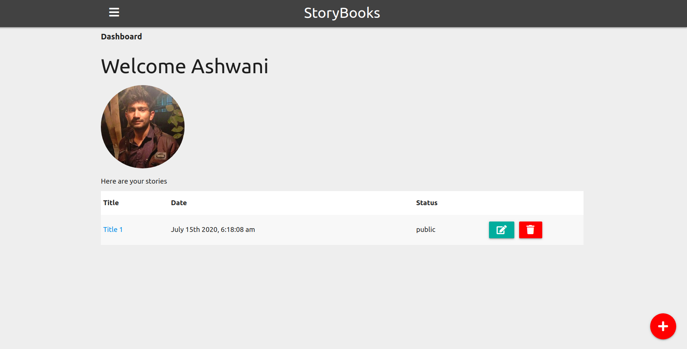
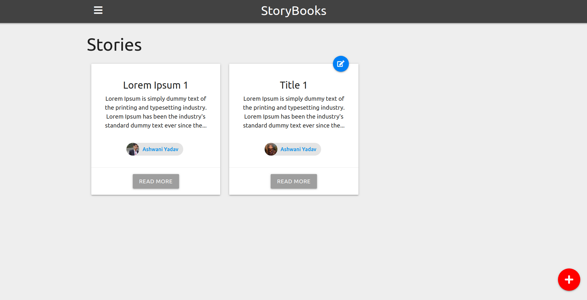
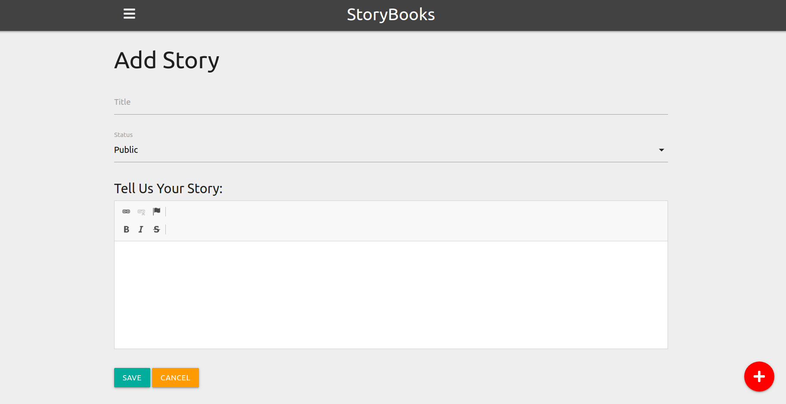

# StoryBooks

> Create public and private stories from your life

This app uses Node.js/Express/MongoDB with Google OAuth for authentication

## Usage

Add your mongoDB URI and Google OAuth credentials to the ./config/config.env file

```
# Install dependencies
npm install

# Run in development
npm run dev

# Run in production
npm start
```
### Screenshots



